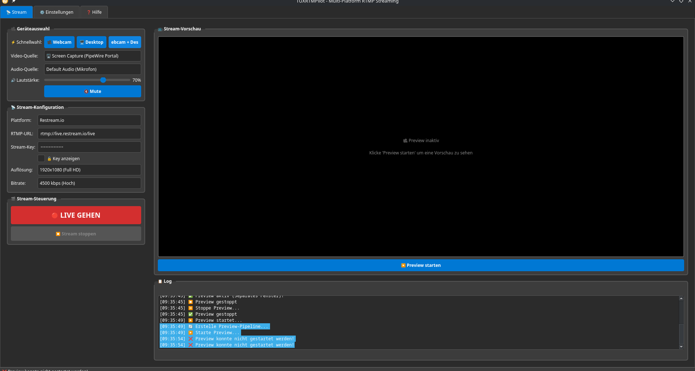

# 🐧 TUXRTMPilot

**Multiplattform-RTMP-Streaming-Tool für Linux/KDE**, entwickelt in **Python (PyQt6 + GStreamer)**.  
Ein leichtgewichtiges, elegantes Open-Source-Studio für Livestreaming auf Twitch, YouTube, TikTok und mehr.

---



> *Screenshot: Aktuelle Benutzeroberfläche mit Geräteauswahl, Preview-Fenster und Log-System.*

---

## 🎯 Ziel

TUXRTMPilot ist ein Streaming-Tool, das speziell für Linux-Benutzer entwickelt wurde, die eine Alternative zu OBS Studio suchen – aber ohne den Ressourcenhunger.  
Es kombiniert eine moderne Qt-Oberfläche mit der mächtigen GStreamer-Pipeline und integriert:
- Bildschirmaufnahme (PipeWire)
- Webcam-Stream
- Audio-Mixing
- RTMP-Streaming auf mehrere Plattformen

---

## ⚙️ Hauptfunktionen

- 🖥️ **Screen Capture (PipeWire)**  
  Streamt deinen Bildschirm direkt über PipeWire oder X11.
- 📸 **Webcam-Unterstützung**  
  Kompatibel mit V4L2-Kameras (z. B. papalook AF925).
- 🎧 **Audio-Quellwahl & Lautstärke-Regelung**  
  Inklusive Mute-Button und Device-Erkennung.
- 🎞️ **Live-Vorschau im Fenster**  
  GStreamer-Preview direkt in der PyQt6-Oberfläche.
- 📡 **RTMP-Streaming**  
  Verbindung zu Twitch, YouTube, TikTok, Restream.io u. v. m.
- 💾 **Backup- und Statussystem**  
  Automatische Sicherung und Versionsstatus via `backup.sh` & `STATUS.md`.
- 🔧 **Erweiterbar & Modular**  
  Klare Code-Struktur: `src/core`, `src/ui`, `src/utils`.

---

## 🧩 Systemanforderungen

- Linux (empfohlen: KDE Plasma / Wayland)
- Python ≥ 3.11  
- PyQt6  
- GStreamer ≥ 1.20  
- gst-plugins-base, good, bad, ugly  
- gst-plugin-pipewire, gst-libav  

Installation unter Arch/CachyOS:
```bash
sudo pacman -S python-pyqt6 gstreamer gst-plugins-base gst-plugins-good gst-plugins-bad gst-plugins-ugly gst-libav gst-plugin-pipewire

🚀 Installation
bash
Code kopieren
git clone https://github.com/Tuxplayers/TUXRTMPilot.git
cd TUXRTMPilot
python3 -m venv venv
source venv/bin/activate
pip install -r requirements.txt
python src/main.py


🧱 Projektstruktur
bash
Code kopieren
TUXRTMPilot/
├── src/
│   ├── core/           # Device-, Stream-, Config-Manager
│   ├── ui/             # PyQt6 GUI (Tabs, Widgets, Preview)
│   └── utils/          # Logging, Helpers
├── backups/            # Automatische Sicherungen
├── docs/               # Dokumentation & Screenshots
├── backup.sh           # Backup-Skript
├── STATUS.md           # Aktueller Entwicklungsstatus
└── README.md           # Diese Datei
🧪 Bekannte Probleme
⚠️ Preview-Fenster zeigt beim Schließen manchmal GStreamer-Fehlermeldung („Output window was closed“)
→ Nicht kritisch, wird in Phase 5 behoben.

🔄 Wayland-Fenster-Handling kann je nach GPU leicht verzögert sein.

👨‍💻 Autor
Heiko Schäfer (TUXPLAYER)
📧 contact@tuxhs.de
🐧 Linux-Enthusiast, Technik-Tüftler
💬 „Ein klarer Stream beginnt mit klarem Code.“

🧾 Lizenz
Dieses Projekt steht unter der GPL v3.
Siehe LICENSE für Details.

⭐ Mitwirken
Pull Requests, Ideen und Verbesserungen sind willkommen!
Wenn du helfen willst, teste Builds, melde Bugs oder schreib neue GStreamer-Module.
