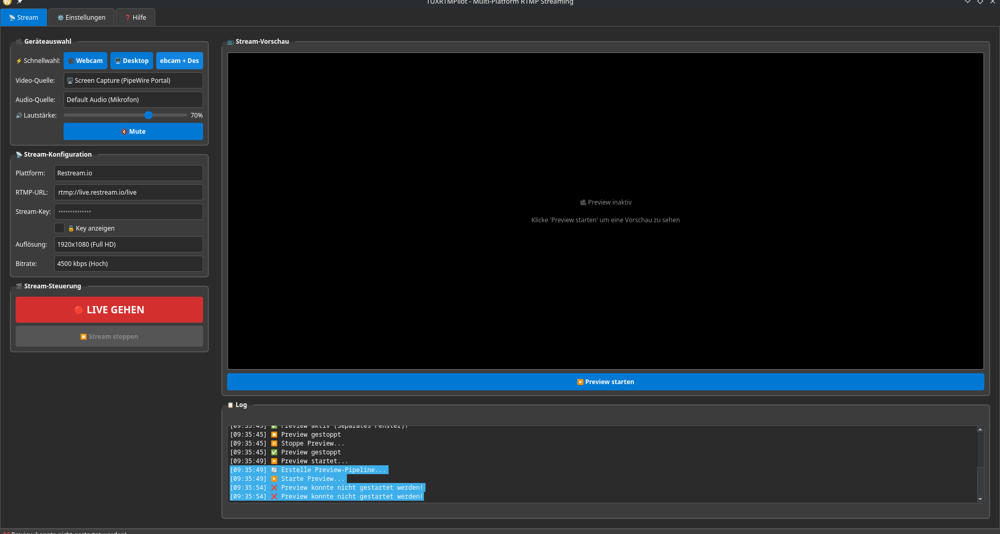

# TUXRTMPilot

Leichtgewichtiges RTMP-Streaming-Tool für Linux.  
Python (PyQt6 + GStreamer) — Alternative zu OBS.

---

## Warum TUXRTMPilot?

| Feature | OBS Studio | TUXRTMPilot |
|---------|------------|-------------|
| Wayland Support | Experimentell | Native |
| Setup-Zeit | 30+ Minuten | 30 Sekunden |
| Audio-Mixing | Kompliziert | Eingebaut |
| Self-Hosting | Umständlich | Einfach |
| Platform Freedom | Twitch/YouTube | Jede RTMP-Platform |
| Ressourcen | Hoch | Optimiert |
| Linux-First | Windows-Port | Native |

---


## Funktionen

**Screen Capture** — PipeWire/X11 Desktop-Streaming

**Multi-Camera** — V4L2-Unterstützung für Webcams und professionelle Kameras

**Audio-Mixing** — Mehrere Quellen gleichzeitig (Mikrofon, System-Audio, Musik-Player)

**Live-Preview** — GStreamer-Vorschau in der GUI

**Stream Targets** — Twitch, YouTube, TikTok, Kick, Owncast, PeerTube, Custom RTMP

**Modular** — Klare Architektur: core, ui, utils

---

## Installation

### Arch/CachyOS

```bash
yay -S tuxrtmpilot
tuxrtmpilot
```

### Andere Distributionen

```bash
git clone https://github.com/Tuxplayers/TUXRTMPilot.git
cd TUXRTMPilot
python3 -m venv venv
source venv/bin/activate
pip install -r requirements.txt
python src/main.py
```

### Self-Hosted (Owncast)

```bash
docker run -d -p 8080:8080 gabek/owncast:latest
# RTMP URL: rtmp://your-server.com:1935/live
```

---

## Systemanforderungen

- Linux (KDE Plasma / Wayland empfohlen)
- Python >= 3.11
- PyQt6
- GStreamer >= 1.20

**Installation (Arch):**

```bash
sudo pacman -S python-pyqt6 gstreamer gst-plugins-{base,good,bad,ugly} gst-libav gst-plugin-pipewire
```

---

## Projektstruktur

```
TUXRTMPilot/
├── backups/            # Automatische Backups
├── backup.sh           # Backup-Script
├── config/             # Konfigurationsdateien
├── docs/               # Screenshots & Dokumentation
├── logs/               # Runtime Logs
├── src/                # Quellcode
│   ├── core/           # Device-, Stream-, Config-Manager
│   ├── ui/             # PyQt6 GUI
│   └── utils/          # Logging, Helpers
├── tests/              # Unit & Integration Tests
├── requirements.txt    # Python-Dependencies
├── STATUS.md           # Roadmap
└── README.md           # Diese Datei
```

---

## Prinzipien

**Freedom First** — Stream wo du willst, nicht wo Big Tech dich zwingt

**Linux Native** — Von Grund auf für Linux gebaut

**Open Source** — Kein Tracking, transparenter Code

**Community Driven** — Features die User wollen

---

## Bekannte Probleme

- Preview-Fenster kann GStreamer-Warnung beim Schließen zeigen (harmlos)
- Wayland-Fenster-Handling bei manchen GPUs minimal verzögert

## Roadmap

- OBS-Scene-Import
- Erweiterte Audio-Filter
- Streaming-Statistiken
- Desktop-Notifications
- Matrix-Chat-Integration

Siehe STATUS.md für Details.

---

## Beitragen

**Designer** — App-Icon, Theme Polish, UI/UX

**Translators** — Englisch, Französisch, Spanisch

**Developers** — Audio-Features, Platform-Presets, Tests

**Testers** — Beta-Testing, Bug-Reports

GitHub: https://github.com/Tuxplayers/TUXRTMPilot/issues  
Email: contact@tuxhs.de

---

## Autor

Heiko Schäfer (TUXPLAYER)  
Linux-Enthusiast | Open Source Advocate | Musiker

---

## Lizenz

GPL v3

```
TUXRTMPilot — Stream Freedom, Not Vendor Lock-In
Copyright (c) 2024-2025 Heiko Schäfer
```

---

Made for Linux Creators who want Freedom
